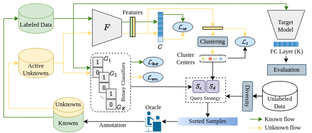

## [EOAL: Entropic Open-set Active Learning](https://arxiv.org/abs/2312.14126) (AAAI 2024)
### Bardia Safaei, Vibashan VS, Celso M. de Melo, Vishal M. Patel
[](https://pytorch.org/)

Active Learning (AL) aims to enhance the performance of deep models by selecting the most informative samples for annotation from a pool of unlabeled data. Despite impressive performance in closed-set settings, most AL methods fail in real-world scenarios where the unlabeled data contains unknown categories. Recently, a few studies have attempted to tackle the AL problem for the open-set setting. However, these methods focus more on selecting known samples and do not efficiently utilize unknown samples obtained during AL rounds. In this work, we propose an Entropic Open-set AL (EOAL) framework which leverages both known and unknown distributions effectively to select informative samples during AL rounds. Specifically, our approach employs two different entropy scores. One measures the uncertainty of a sample with respect to the known-class distributions. The other measures the uncertainty of the sample with respect to the unknown-class distributions. By utilizing these two entropy scores we effectively separate the known and unknown samples from the unlabeled data resulting in better sampling. Through extensive experiments, we show that the proposed method outperforms existing state-of-the-art methods on CIFAR-10, CIFAR-100, and TinyImageNet datasets.



Table of Contents
=================

   * [Setup and Dependencies](#setup-and-dependencies)
   * [Run](#run)
      * [CIFAR-10](#cifar-10)
      * [CIFAR-100](#cifar-100)
   * [Reference](#reference)

## Setup and Dependencies

1. Create and activate a conda environment with Python 3.7 as follows: 
```
conda create -n EOAL python=3.7.16
conda activate EOAL
```
2. Install dependencies: 
```
pip install -r environment.txt
``` 
3. Modify the dataloader.py file in the torch.util.data.Dataloader source code as described [here](https://github.com/ningkp/LfOSA/issues/4).
   
## Run 
First, create a folder `~/data`, the datasets will be automatically downloaded to this folder upon running the code.
### CIFAR-10
For the CIFAR-10 experiment with a mismatch ratio of 20%, run:

```
python main.py --query-strategy eoal --init-percent 1 --known-class 2 --query-batch 1500 --seed 1 --model resnet18 --dataset cifar10 --max-query 11 --max-epoch 300 --stepsize 60 --diversity 1 --gpu 0
```

### CIFAR-100

For the CIFAR-100 experiment with a mismatch ratio of 20%, run:

```
python main.py --query-strategy eoal --init-percent 8 --known-class 20 --query-batch 1500 --seed 1 --model resnet18 --dataset cifar100 --max-query 11 --max-epoch 300 --stepsize 60 --diversity 1 --gpu 0
```

Here is a description of some important arguments:
1. --query-strategy: # Active sampling method. Supports random and eoal.
2. --init-percent: # Initial labeled data percentage. Use 1 for cifar10 and 8 for cifar100 and tiny-imagenet.
3. --known-class: # Mismatch ratio. For 20%, 30%, 40%, use 2,3,4 and 20,30,40 for cifar10 and cifar100, respectively.
4. --query-batch: # Annotation budget. Use 1500 for all experiments
5. --max-query: # Number of AL cycles. Use 11 for 10 AL cycles (the first round shows the performance on the initial labeled data).
6. --diversity: # Whether to use diversity sampling. The default value is 1.
## Reference

If you find this codebase useful in your research, please consider citing our paper:
```
@inproceedings{safaei2024entropic,
  title={Entropic open-set active learning},
  author={Safaei, Bardia and Vibashan, VS and de Melo, Celso M and Patel, Vishal M},
  booktitle={Proceedings of the AAAI Conference on Artificial Intelligence},
  volume={38},
  number={5},
  pages={4686--4694},
  year={2024}
}
```

## Acknowledgements

This code is built upon [LfOSA](https://github.com/ningkp/LfOSA) repository.
